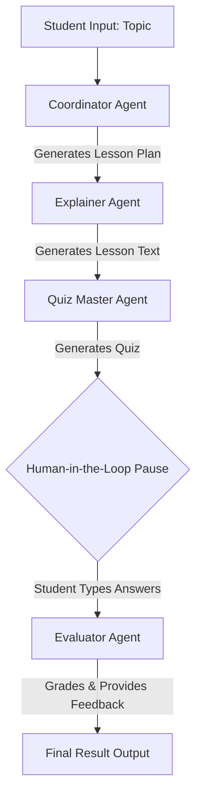

# 🎓 Leo: Multi-Agent AI Tutor

Leo is a collaborative, multi-agent educational assistant built using **CrewAI** and powered by Groq's high-speed LLM inference. Instead of relying on a single chatbot, Leo utilizes four specialized AI agents that pass contextual memory to one another to design, teach, test, and evaluate a student's knowledge.

This project features both a **Command Line Interface (CLI)** with built-in Human-in-the-Loop execution, and an interactive **Streamlit Web UI** featuring a state-machine workflow.

## 🤖 The Agents & Their Roles
1. **Coordinator** *(Lead Educational Strategist)*: Takes the student's raw topic, handles vagueness, and drafts a structured 3-point lesson plan.
2. **Explainer** *(Subject Matter Expert)*: Takes the Coordinator's plan and teaches the concept using clear analogies, simple language, and strict LaTeX mathematical formatting.
3. **Quiz Master** *(Assessment Creator)*: Generates a 3-question multiple-choice test based strictly on the Explainer's lesson text using targeted Few-Shot prompting.
4. **Evaluator** *(Feedback Coach)*: Analyzes the student's human input, grades their answers, and provides constructive feedback on what they got right or wrong.

## 🏗️ Architecture & Orchestration Pattern
**Orchestration Pattern:** Sequential Process with Human-in-the-Loop (Bonus Feature).

The crew relies on sequential execution with explicit task context handoffs. The output of the Coordinator becomes the input of the Explainer, ensuring real handoffs rather than isolated outputs. The system implements a Human-in-the-Loop pause to fetch real-world input from the student before evaluation.


### 🚀 How to Run
**1. Install dependencies**
```bash
pip install -r requirements.txt
```
**2. Configure Environment**
Create a .env file in the root directory and put your GROQ API key there.
```bash
GROQ_API_KEY=your_groq_api_key_here
```
**3. Run the Streamlit UI**
```bash
streamlit run app.py
```
**4. Run the CLI Version**
```bash
python main.py
```